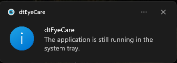

# eyebreak


eyebreak is a free Windows app that reminds you to take regular eye breaks while working. It follows the **20-20-20 rule** by default, a short break every 20 minutes and a longer one every 2 hours, but every interval is configurable.

## Screenshots

| App Startup | Notification Toast |
|---|---|
|  |  |

> Note: these screenshots show an earlier version of the settings window; the current UI adds configurable intervals and live countdowns (see Usage below).

## Tech Stack

| Layer | Tool |
|---|---|
| Language | C# |
| UI Framework | Windows Forms |
| Platform | Windows 10+ |
| Runtime | .NET 9 |
| Tests | xUnit |

## Installation

1. Download the latest release from the [Releases](https://github.com/dincertekin/eyebreak/releases/latest) page.
2. Extract and run `eyebreak.exe` — no installation required.

## Usage

- The app runs silently in the background and appears in the system tray; double-click the tray icon to open the settings window.
- Enable or disable short and long breaks independently, and set their intervals in minutes — changes are saved automatically and a live countdown to each break is shown.
- Optionally play a sound alongside the reminder balloon, and choose whether eyebreak launches at Windows startup.
- Right-click the tray icon for quick actions: **Take a break now**, **Snooze for 5 minutes**, or **Exit**.
- The app follows your Windows light/dark theme setting.

## Troubleshooting

If the app does not appear in the system tray, your tray may be hiding icons. Go to **Windows Taskbar Settings** and make sure eyebreak is set to always show.

## Building

```
dotnet build eyebreak.sln                                  # build
dotnet test eyebreak.sln                                   # run the test suite
dotnet publish -c Release -p:PublishProfile=win-x64        # produce a self-contained, single-file eyebreak.exe
```

## Contributing

Contributions are welcome. See [CONTRIBUTING.md](./CONTRIBUTING.md) for how to get started.

## License

[MIT License](./LICENSE)
